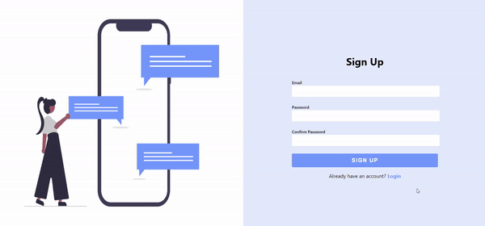
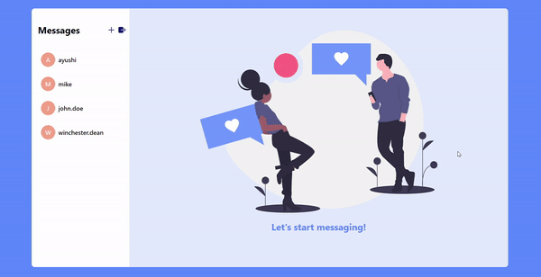
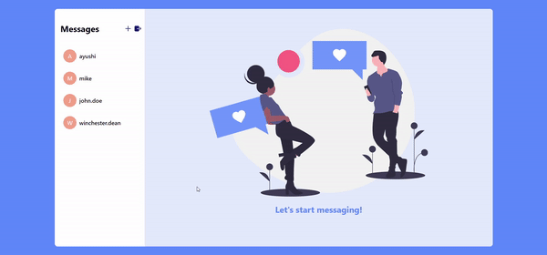

# Chat App
A basic Chat App made using Firestore.

Big thanks to [@karanpratapsingh](https://github.com/karanpratapsingh) for reviewing the repo and suggesting optimizations!

## Demo

 
 

 

 

## Technologies used

## Running the project
This project was bootstrapped with [Create React App](https://github.com/facebook/create-react-app).

In the project directory, you can run:

#### `yarn start`

It runs the app in the development mode. 
Open [http://localhost:3000](http://localhost:3000) to view it in the browser.

